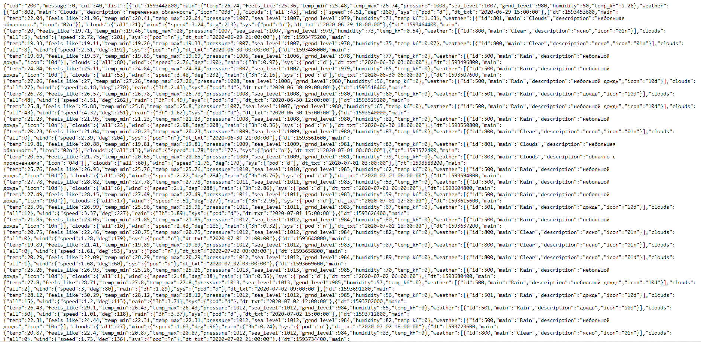
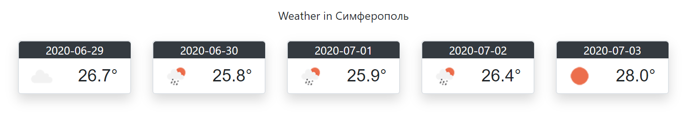

<!DOCTYPE HTML>
 <html>
 <body>
 
МИНИСТЕРСТВО НАУКИ  И ВЫСШЕГО ОБРАЗОВАНИЯ РОССИЙСКОЙ ФЕДЕРАЦИИ  
Федеральное государственное автономное образовательное учреждение высшего образования  
"КРЫМСКИЙ ФЕДЕРАЛЬНЫЙ УНИВЕРСИТЕТ им. В. И. ВЕРНАДСКОГО"  
ФИЗИКО-ТЕХНИЧЕСКИЙ ИНСТИТУТ  
Кафедра компьютерной инженерии и моделирования
<br/><br/>
 
### Отчёт по лабораторной работе №1 <br/> по дисциплине "Программирование"
<br/>
 
студента 1 курса группы ПИ-203<br/>
Руденко Кирилла<br/>
направления подготовки 09.03.04 "Порограммная инженерия"  
<br/>
 
<table>
<tr><td>Научный руководитель<br/> старший преподаватель кафедры<br/> компьютерной инженерии и моделирования</td>
<td>(оценка)</td>
<td>Чабанов В.В.</td>
</tr>
</table>
<br/><br/>
 
Симферополь, 2020
 
 <hr>
 
# Лабораторная работа №1 Погодный информер

Цель:

1. Закрепить навыки разработки многофайловыx приложений;
2. Изучить способы работы с API web-сервиса;
3. Изучить процесс сериализации/десериализации данных.
 
## Постановка задачи:
 
Разработать приложение на языке С++ предназначенное для отображения прогноза погоды на ближайшие пять дней. В качестве источника данных о погоде использовать [сервис](https://openweathermap.org/). Вывод информации осуществлять при помощи web-интерфейса.
<br/><br/>
Приложение должно работать следующим образом:
<br/>
1. Пользователь открывает браузер;
2. Вводит в адресную строку localhost:3000. Здесь 3000 — это номер порта;
3. В вашем приложении должен быть сервер «слушающий» 3000 порт. Он принимает запрос от браузера и вызывает функцию обработки запроса;<br/><br/>
В функции обработки запроса:<br/>

1. Создаётся клиент, который посылает запрос на openweathermap.org;
2. Используя ответ, полученный от openweathermap.org, заполняется html-шаблон погодного виджета;
3. Получившаяся html-страница отдаётся браузеру;
4. Пользователь видит html-страницу заполненную информацией о погоде на ближайшие пять дней.
 
## Ход работы:
1. Подготовка серверной части<br/>
2. Подготовка к работе с сервисом openweathermap.org<br/>
3. Подготовка клиента для получения информации от openweathermap.org<br/>
4. Подготовка к работе с JSON<br/>
5. Подготовка шаблона виджета<br/>
6. Сборка итогового проекта<br/><br/>

**1. Мой ApiKey:** 972fd830382f29a6444f8d201551687<br/>

**2. Результат запроса в формате json:**
  <figure class="sign">
  
  <figcaption> <i><br/>Рис.1 Json ответ </i></figcaption>
  </figure>
  <br/><br/>

**3. Код программы *"6labProj.cpp"*:**
 
  ```C++
  #include <iostream>
  #include <httplib/httplib.h>
  #include <nlohmann/json.hpp>
  //Библиотека чтения и записи из файла
  #include <fstream>
  
  using namespace std;
  using namespace httplib;
  using namespace nlohmann;
  
  //Функция, чтобы не повторять и не нагромождать код заменой текста в блоках
  void replace(string& subject, string search_value, string new_value) {
    if (
      // Если в строке subject есть search_value
      subject.find(search_value) !=
      //Это значение того, что ничего не найдено
      std::string::npos
      )
    {
      // Функция replace() выполняет замену символов в вызывающей строке
      subject = subject.replace(
          //Значение, которое заменю subject.find(search_value) (size_type start) 
          subject.find(search_value),
          //Количество символов в вызывающей строке search_value.length() (size_type num)
          search_value.length(),
          //Которые я заменю всей строкой new_value (const string &s) 
          new_value
        );
    }
  }
  
  //Функция для урезания чисел после запятой
  string prepare_number(double number) {
    //Инициализирую строкой значение
    string str = to_string(number);
    //Если разделителем служит запятая, тогда заменяю её точкой
    replace(str, ",", ".");
    //Возвращаю значение в диапазоне от нулевого значения, до второго числа (не включительно)
    return str.substr(0, str.find('.') + 2);
  }
  
  // В этой функции формируем ответ сервера на запрос
  void gen_response(const Request& req, Response& res) {
    //Объект, из которого считываю информацию
    ifstream fin;
    //Будет хранить информацию из файла "informer_newstrlate.html"
    string templateСontent;
    //Открываю файл
    fin.open(R"(informer/informer.html)");
    //Проверка на открытие файла
    if (!fin.is_open()) {
      cout << "Ошибка! Не получилось открыть файл 'informer_newstrlate.html'";
      return;
    }
    //Записываю информацию из файла в строку
    std::getline(fin, templateСontent, '\0');
    //Закрываю файл
    fin.close();
    //Создаю клиента
    Client cli(
      //Имя хоста
      "api.openweathermap.org", 
      //Порт 80 (порт по умолчанию для http)
      80);
    //Клиент просит ресурс
    auto clientRes = *cli.Get(R"(/data/2.5/forecast?q=Simferopol&units=metric&lang=ru&appid=8972fd830382f29a6444f8d201551687)");
    if (
      //res->status == 200 проверяет, удалось ли загрузить страницу
      clientRes.status == 200){
      // Десериализация ответа, полученного от сервиса openweathermap.org, в JSON объект.
      //явный анализ
      json forecastDump = json::parse(clientRes.body);
  
      for (int i = 0; i < forecastDump["cnt"].get<short>(); i += 8) {
        //Вызываю функцию, в которой буду вызывать метод replace() у класса 
        replace(
          //Загружаю где буду заменять
          templateСontent,
          //Какую область в файле выбираю для замены
          "{list.dt}",
          //На какое значение/данные заменю эту область
          //В объекте json смотрю в области list все даннве по датам,
          //Привожу к string 
          forecastDump["list"][i]["dt_txt"].get<string>().substr(
            //И обрезаю от первого символа до знака пробела
            0,
            forecastDump["list"][i]["dt_txt"].get<string>().find(' ')
          )
        );
        //Аналогичным образом
        replace(
          templateСontent, 
          "{list.main.temp}",
          //Только здесь преобразую число типа double в строку
          prepare_number(forecastDump["list"][i]["main"]["temp"].get<double>())
        );
  
        replace(
          templateСontent, 
          "{list.weather.icon}", 
          forecastDump["list"][i]["weather"][0]["icon"].get<string>()
        );
      }
      //Отдельно делаю для названия города
      replace(templateСontent, "{city.name}", forecastDump["city"]["name"]);
  
      //Отправляю на сервер, предварительно записав данные в html
      res.set_content(
        //Заполненный шаблон передайте первым параметром
        templateСontent,
        //В качестве второго параметра передайте text/html
        //Указываю кодировку (чтобы можно было использовать русский язык)
        "text/html; charset=utf-8");
    }
    //
    else {
      res.set_content("Ошибка в сервере!", 
        //Передаю в файл и указываю кодировку
        "text/html; charset=utf-8");
    }
  }
  
  int main() {
    //Делаю так, чтобы читался русский язык как при вводе текста, так и при выводе
    //Установка кодовой страницы win-cp 1251 в поток ввода
    SetConsoleCP(1251);
    //Установка кодовой страницы win-cp 1251 в поток вывода
    SetConsoleOutputCP(1251);
    //Создаём сервер (пока-что не запущен)
    Server svr;
    //Вызвать функцию gen_response если кто-то обратиться к корню "сайта"
    svr.Get("/", gen_response);
    //Запускаем сервер на localhost и порту 3000
    svr.listen("localhost", 3000);
  }
  ```
<br/>

**3. Скриншот экрана с демонстрацией работы программы:**
  <figure class="sign">
  
  <figcaption> <i><br/>Рис.2 Заполненный виджет </i></figcaption>
  </figure>
  
<br/><br/>

   **Вывод:** данная лабораторная работа стала хорошим опытом для изучения работы с передачей данных по сети. Я научился работать с библиотекой json, а также с локальным сервером компьютера.
  
 </body>
 </html>